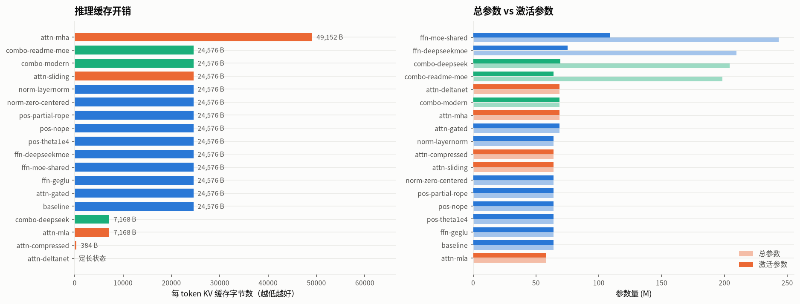
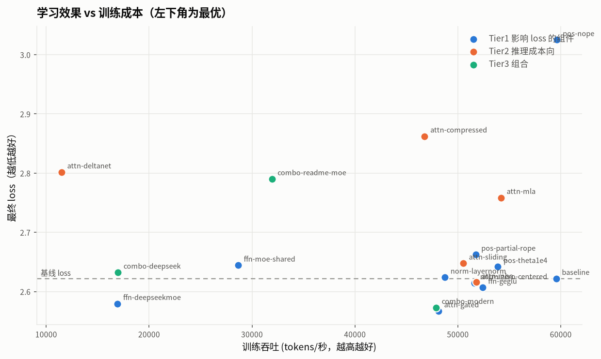
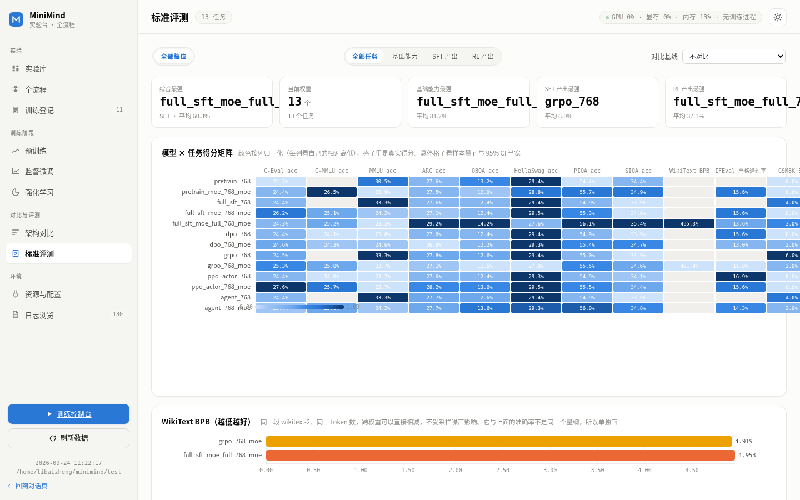

<div align="center">


### 极简 · 模块化 · 全流程大模型训练框架

**换一种注意力，改几行 YAML ｜ 换一种训练算法，换一个 `--algo`**

[](LICENSE)
[](https://pytorch.org)
[](https://www.python.org)
[](https://huggingface.co/datasets/jingyaogong/minimind_dataset)
[](https://www.modelscope.cn/datasets/gongjy/minimind_dataset/files)
[](https://github.com/Bozheng-Li/MInimind-V2/pulls)

<p align="center">
  <a href="#quickstart">⚡ 极速上手</a> •
  <a href="#architecture">🧩 架构全景</a> •
  <a href="#algorithms">🚀 16种算法</a> •
  <a href="#experiments">📊 实验与消融</a> •
  <a href="#webui">🖥️ Web控制台</a> •
  <a href="#datasets">📦 数据集</a> •
  <a href="./README_en.md">🌐 English</a>
</p>

<!-- Live Demo -->


</div>

---

### ✨ 核心特性

<table align="center" width="100%">
  <tr>
    <td width="50%">
      <h4>🧩 四槽模块化架构</h4>
      <p>Attention · FFN · Positional · Norm 完全解耦。18 个前沿组件 YAML 自由组合（GQA / MLA / SwiGLU / DeepSeekMoE 等），新增算子只需单文件 <code>@register</code>。</p>
    </td>
    <td width="50%">
      <h4>🚀 16 种训练算法一体化</h4>
      <p>Pretrain · SFT · LoRA/QLoRA · Distill · DPO/KTO/SimPO · PPO/GRPO/DAPO · Agent RL，单训练器 <code>--algo</code> 一键切换，共享相同底层优化。</p>
    </td>
  </tr>
  <tr>
    <td width="50%">
      <h4>📊 严谨等算力消融基准</h4>
      <p>18 组等预算扫描（61M token 与 1.39B SFT 双臂）。提供真实 Pareto 前沿、吞吐与 KV Cache 效率对比，彻底杜绝隐式实现偏差。</p>
    </td>
    <td width="50%">
      <h4>🖥️ 原生极简 Web 控制台</h4>
      <p>零 npm、零构建的 FastAPI 原生控制台。整合实时推理对话（<code>/</code>）、多模型评测实验台（<code>/lab</code>）、训练监控大屏（<code>/train</code>）。</p>
    </td>
  </tr>
</table>

---

<a id="quickstart"></a>
## ⚡ 30 秒极速上手

### 1. 环境准备

```bash
git clone https://github.com/Bozheng-Li/MInimind-V2.git
cd MInimind-V2
pip install -r requirements.txt  # torch 请根据自身 CUDA 版本独立安装
```

### 2. 下载数据并放置

下载 [mini 预训练集 (1.2GB)](https://huggingface.co/datasets/jingyaogong/minimind_dataset) 与 [mini SFT 集 (1.6GB)](https://www.modelscope.cn/datasets/gongjy/minimind_dataset/files)，放入对应目录：

```bash
dataset/pretrain/pretrain_t2t_mini.jsonl
dataset/sft/sft_t2t_mini.jsonl
```

### 3. 一键训练与评测

```bash
# 1. 预训练
python trainer/train.py --algo pretrain --config configs/pretrain.yaml

# 2. 监督微调 (SFT)
python trainer/train.py --algo sft --config configs/sft.yaml

# 3. 终端推理交互
python trainer/eval.py --config configs/sft.yaml --weight full_sft
```

> 💡 **切换为 Gated 注意力 + 细粒度 MoE 架构**：
> ```bash
> python trainer/train.py --algo pretrain --config configs/pretrain_moe.yaml
> python trainer/train.py --algo sft      --config configs/sft_moe.yaml
> ```

---

<a id="architecture"></a>
## 🧩 四槽可插拔架构

模型拆分为四个标准槽位，所有组件在 `arch/` 下声明注册。换结构只需改 YAML：

<table align="center" width="100%">
  <tr>
    <td align="center" width="50%"><b>Dense 结构 (GQA + SwiGLU)</b></td>
    <td align="center" width="50%"><b>MoE 细粒度结构 (Gated + Finegrained MoE)</b></td>
  </tr>
  <tr>
    <td align="center"></td>
    <td align="center"></td>
  </tr>
</table>

### 18 个已注册组件全景

| 槽位 | `type` | 灵感来源 | 特性解析 |
|---|---|---|---|
| **Attention** | `gqa` | Llama / Qwen | 分组查询注意力 + QK-Norm，KV 头数设为 1 即 MQA |
| | `gated` | Qwen3-Next | 输出门控 + 零中心 QK-Norm，支持 partial RoPE |
| | `sliding_window` | Mistral / Gemma | 局部滑动窗口，限制注意力半径 `window_size` |
| | `mla` | DeepSeek-V2/V3 | 低秩投影压缩 KV，解耦 RoPE 维度（224B/token vs GQA 768B） |
| | `compressed` | DeepSeek-V4 | 沿序列维步长压缩，大幅缩减 KV 缓存（384B/token） |
| | `deltanet` | Qwen3-Next | 线性注意力，固定状态大小替代自回归 KV cache |
| **FFN** | `swiglu` / `geglu` | Llama / Gemma | 经典门控 FFN，分别使用 SiLU / GELU 激活 |
| | `moe` | 经典顶会结构 | Top-k 路由 + 负载均衡辅助损失 (aux loss) |
| | `moe_shared` | DeepSeekMoE | 共享专家常驻 + N 个稀疏路由专家 |
| | `moe_finegrained` | DeepSeek-V3 | 细粒度切分专家，可学习 bias 无辅助损均衡 |
| **Positional** | `rope` | RoFormer | 旋转位置编码，支持 YaRN 动态插值扩上下文 |
| | `partial_rope` / `nope` | — | 仅对前几维施加旋转 / 完全不添加位置编码 |
| **Norm** | `rmsnorm` | Llama | 经典 RMSNorm |
| | `rmsnorm_zero_centered`| Qwen3-Next | 初始权重置零，等价于平滑恒等变换 |
| | `layernorm` | Transformer | 经典双统计量 LayerNorm |

### 架构效率：KV 缓存与显存占用对比

<div align="center">
  
</div>

```yaml
# configs/experiments/mla_finegrained.yaml (极简覆写，其余继承 base.yaml)
attention:
  type: mla
  num_attention_heads: 8
  num_key_value_heads: 4
ffn:
  type: moe_finegrained
  num_experts: 8
  num_experts_per_tok: 2
```

---

<a id="algorithms"></a>
## 🚀 16 种训练算法一体化

算法统一定义于 `trainer/algos/`，从 Next-Token 预测、偏好对齐到多轮工具调用强化学习全链路打通。

<div align="center">
  
</div>

### 算法矩阵

| 训练阶段 | 算法 | 外部依赖 | 核心适用场景 |
|---|---|---|---|
| **预训练** | `pretrain` | — | 海量文本自监督 Next-Token 训练 |
| **指令微调** | `sft` | — | 全参数对话/任务指令监督微调 |
| **参数高效微调** | `lora` · `qlora` | bitsandbytes | 极低显存消费，支持 NF4 双重量化 |
| **知识蒸馏** | `distill` | Teacher 模型 | 白盒分布蒸馏，向大模型对齐 logits |
| **离线偏好对齐** | `dpo` · `ipo` · `kto` | Reference 模型 | 成对标注数据 (chosen / rejected) 对齐 |
| **无 Reference 对齐** | `simpo` · `cpo` · `orpo` | — | 节省 50% 模型显存，单模型直接偏好优化 |
| **在线强化学习 (无 Critic)** | `grpo` · `rloo` | Reward + Reference | 规则验证型任务 (数学/代码)，显存友好 |
| | `dapo` | Reward | Clip-Higher 与 token 级自适应 loss 目标 |
| **Actor-Critic RL** | `ppo` | Reward + Ref + Critic | 经典全功能 PPO 强化学习 |
| **Agent 工具强化学习** | `agent` | Reward + 工具环境 | 多轮 Tool-Call 自动交互与动作空间优化 |

> 📌 **训练关键说明**：
> - **在线强化学习默认采用 CISPO**（`--loss_type cispo`），有效避免梯度被对称裁剪抹平。
> - **一键多卡分布式启动**：
>   ```bash
>   torchrun --nproc_per_node 4 trainer/train.py --algo grpo --config configs/rl.yaml
>   ```

---

<a id="experiments"></a>
## 📊 实验结论与损失曲线

在严格等 Token 预算（61M tokens）和同 Seed、同数据分布下对 18 组架构进行了全景实测扫描。

<table align="center" width="100%">
  <tr>
    <td align="center" width="52%"><b>全维度基准雷达图 (Benchmark Radar)</b></td>
    <td align="center" width="48%"><b>算力 vs 收益 Pareto 前沿面</b></td>
  </tr>
  <tr>
    <td align="center"></td>
    <td align="center"></td>
  </tr>
</table>

### 全生命周期训练损失收敛画廊

<table align="center" width="100%">
  <tr>
    <td align="center" width="50%"><b>① 预训练收敛曲线 (Pretrain Loss)</b><br></td>
    <td align="center" width="50%"><b>② 指令微调收敛曲线 (SFT Loss)</b><br></td>
  </tr>
  <tr>
    <td align="center" width="50%"><b>③ GRPO 在线强化学习曲线</b><br></td>
    <td align="center" width="50%"><b>④ Agent 工具调用强化学习曲线</b><br></td>
  </tr>
</table>

<details>
<summary>🔍 点击展开：PPO 损失收敛曲线 & RoPE 长度外推评测</summary>

<table align="center" width="100%">
  <tr>
    <td align="center" width="50%"><b>PPO 训练全指标收敛</b><br></td>
    <td align="center" width="50%"><b>RoPE 扩展长度与 PPL 变化</b><br></td>
  </tr>
</table>

</details>

### 实验站住的 5 项核心定论

1. **门控注意力稳健收益**：Gated Attention 获得 Δloss −0.055 的稳定提升，达到相同 loss 只需 0.84× 步数（已纳入主线配置）。
2. **MoE 必须按等算力核算**：SFT 双臂实测，MoE（214M / 激活 80M）相比 Dense（64M）验证 loss 从 0.6370 降至 0.5523（−0.0847），但吞吐为 Dense 的 22%。
3. **极小模型下不要过度省缓存**：在 64M 规模下，MLA/Compressed 降低了参数表达能力，loss 反升；该技巧更适合数十亿级别大模型。
4. **位置编码保持经典 RoPE 最佳**：`rope_theta=1.0e+6` 表现优异，完全剥离位置编码（NoPE）性能显著劣化。
5. **后训练四算法在 64M 的标准 benchmark 上均无明显分别力**：需要结合多轮 Agent 工具场景与特定验证任务检验强化学习效果。

---

<a id="webui"></a>
## 🖥️ 原生全栈 Web 控制台

纯原生开发（FastAPI + 原生 JS/CSS），**无 node/npm、无复杂前端打包、无 CDN 依赖**，启动即用。

<table align="center" width="100%">
  <tr>
    <td align="center" width="50%"><b>实时对话与工具调用 (<code>/</code>)</b><br></td>
    <td align="center" width="50%"><b>多模型评测实验台 (<code>/lab</code>)</b><br></td>
  </tr>
</table>

```bash
# 启动控制台（默认端口 7860）
python webui/server.py

# 启动并稍后在界面中按需载入权重
python webui/server.py --no-load
```

| 访问路由 | 页面定位 | 核心能力 |
|---|---|---|
| `http://localhost:7860/` | **对话终端** | 任意架构原生 `.pth` 模型加载、流式响应、思考链 `<think>` 与工具调用渲染 |
| `http://localhost:7860/lab` | **模型实验台** | 跨架构指标横向对比、13 项评测集雷达展现、Pareto 散点图可视化 |
| `http://localhost:7860/train` | **训练大屏** | 当前训练实时 Loss / 吞吐 / 显存占用曲线监控 |

---

<a id="datasets"></a>
## 📦 数据集与获取

<div align="center">
  
</div>

<p align="center">
  <a href="https://huggingface.co/datasets/jingyaogong/minimind_dataset"></a>
  &nbsp;&nbsp;&nbsp;&nbsp;&nbsp;&nbsp;&nbsp;&nbsp;
  <a href="https://www.modelscope.cn/datasets/gongjy/minimind_dataset/files"></a>
</p>

| 阶段 | 文件 | 大小 | 规模 / 说明 |
|---|---|---|---|
| **预训练** | `pretrain_t2t.jsonl` | 10.0 GB | 847 万条，约 3.2B Tokens 全量无监督语料 |
| | `pretrain_t2t_mini.jsonl` | 1.2 GB | 127 万条，精简起步预训练语料 |
| **指令微调** | `sft_t2t.jsonl` | 14.0 GB | 511 万条，覆盖通用对话、QA、代码及工具调用 |
| | `sft_t2t_mini.jsonl` | 1.6 GB | 90.6 万条，快速验证指令集 |
| **强化学习** | `dpo.jsonl` · `rlaif.jsonl` | ~1.5 GB | 成对偏好对齐数据集 |
| | `agent_rl.jsonl` · `agent_rl_math.jsonl` | ~200 MB | 多轮环境工具调用与数学推理语料 |

预训练支持多数据源按比例自由混合：
```yaml
data:
  path: dataset/pretrain
  mix:
    pretrain_t2t.prose.jsonl: 0.70
    pretrain_t2t.qa.jsonl:    0.10
    pretrain_t2t.en.jsonl:    0.15
    pretrain_t2t.code.jsonl:  0.05
```

---

## ⚡ 推理、服务与生态兼容

MiniMind-V2 提供了完整的生产级服务与转换工具：

```bash
# 1. 启动兼容 OpenAI API 的推理服务 (包含 reasoning_content 与 tool_calls)
python scripts/serve_openai_api.py --config configs/sft.yaml --weight full_sft

# 2. 将原生 .pth 转换导出为 HuggingFace Transformers 格式
python scripts/convert_model.py --torch_path test/full_sft.pth --output_dir ./minimind-hf

# 3. 运行多轮工具调用自动化测试基准
python scripts/agent_eval.py
```

支持快速接入 **vLLM**、**llama.cpp**、**Ollama** 等主流部署引擎。

---

<details>
<summary>📂 <b>点击展开：仓库目录树与最佳实践</b></summary>

### 目录结构

```text
arch/        四槽位 × 18 组件定义（attention / ffn / positional / norm）
configs/     分阶段 YAML 配置与继承引擎
trainer/     统一训练入口、16 个算法实现与训练脚手架
model/       兼容层：保留历史接口，确保既有 .pth 仍可 strict=True 载入
dataset/     数据加载器（LMDataset）与数据说明
webui/       原生极简 Web 控制台（对话 / 实验台 / 训练监视）
scripts/     API 服务、模型转换、评测辅助工具
tests/       公式级单元测试与回归套件
test/        本地实验产物（日志、权重、报告，不进 git）
```

### 避坑指南

1. **不同架构权重不可直接互载**：例如 MLA 与 GQA 的投射维度不同，切换架构需指定 `--from_weight none`。
2. **变长 RL Rollout 需启用 Flash Attention**：开启 `attention.flash_attn_masked: true`，避免 PyTorch SDPA 退回 eager 模式导致显存爆炸。
3. **YAML 中科学计数法必须带正负号**：例如写 `1.0e+6`，若写 `1.0e6` 会被 PyYAML 判定为字符串。
4. **`update_ratio` 标度**：计算逐参数变化 `rms(Δw) / rms(w)`，正常数量级在 1e-4 ~ 1e-3 之间。

</details>

---

## 🙏 致谢与引用

本仓库模型结构、基础训练数据与评测设计继承并升级自 [MiniMind](https://github.com/jingyaogong/minimind)。感谢作者 **Jingyao Gong** 将「从 0 训一个小模型」的设计思路无私开源。

如果您在研究或项目中使用了 MiniMind-V2，请同时引用：

```bibtex
@misc{minimind,
  title  = {MiniMind: Train a Tiny LLM from Scratch},
  author = {Jingyao Gong},
  year   = {2024},
  url    = {https://github.com/jingyaogong/minimind}
}
```

## 📄 开源许可证

本项目基于 [Apache 2.0 License](LICENSE) 开源。
